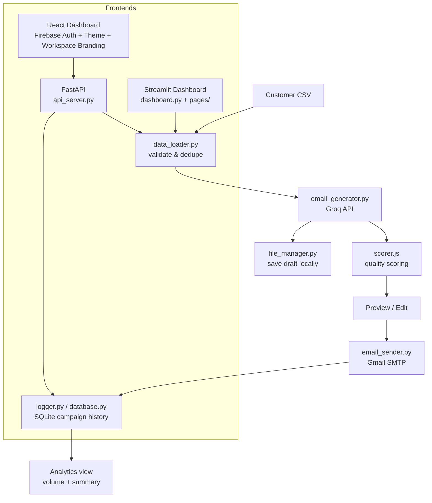

<div align="center">


# ✉️ MailForge AI

<h3>AI-powered email campaign automation</h3>

<p><em>Upload a customer list, generate personalized outreach emails with an LLM, score their quality, review and send them, and track every campaign from a branded dashboard.</em></p>

</div>

---

## ✨ What it does

MailForge AI turns a plain customer CSV into a personalized, reviewed email campaign:

- 📂 **Upload** a CSV of customers (name, email, interest)
- 🤖 **Generate** personalized email drafts per customer using the **Groq API**
- 📝 **Score drafts** on professionalism, clarity, grammar, and spam risk before sending
- 👀 **Preview & edit** drafts, with dry-run support before a real send
- 📧 **Send** via Gmail SMTP, with per-recipient duplicate-send protection
- 🗂 **Auto-save** every generated draft locally
- 📊 **Track** campaign history and delivery status in SQLite, visualized on an analytics view
- 🏢 **Brand your workspace** — upload a company logo/banner that appears in email previews
- 🌗 **Light/dark theme**, persisted across sessions
- 🔐 **Authenticate** via Firebase (React dashboard)

## 🖥️ Two ways to use it

MailForge ships with **two interchangeable frontends** talking to the same backend logic:

| Interface | Best for | Entry point |
| --- | --- | --- |
| **React Dashboard** | Full experience — auth, workspace branding, campaign builder, draft scoring, analytics, history | `frontend/` → FastAPI (`api_server.py`) |
| **Streamlit Dashboard** | Fast local use, multi-page (Campaign Builder, History), no separate frontend build needed | `dashboard.py` + `pages/` |

## 🧠 Architecture



## 🧩 Core components

| File | Responsibility |
| --- | --- |
| [api_server.py](api_server.py) | FastAPI backend — customer upload, async campaign generation/send jobs (with status polling), history, dashboard summary, analytics volume |
| [dashboard.py](dashboard.py) | Streamlit entrypoint (upload → generate → send) |
| [pages/1_Campaign_Builder.py](pages/1_Campaign_Builder.py) / [pages/2_History.py](pages/2_History.py) | Additional Streamlit multi-page views |
| [app.py](app.py) | CLI entrypoint for running a campaign without any UI |
| [modules/data_loader.py](modules/data_loader.py) | Loads and validates customer CSVs, checks required columns |
| [modules/email_generator.py](modules/email_generator.py) | Builds prompts and calls the Groq API to draft personalized emails |
| [modules/email_sender.py](modules/email_sender.py) | Sends mail via Gmail SMTP |
| [modules/validator.py](modules/validator.py) | Email address format validation |
| [modules/database.py](modules/database.py) / [modules/logger.py](modules/logger.py) | SQLite-backed campaign history, duplicate-send checks, logging |
| [modules/file_manager.py](modules/file_manager.py) | Persists generated drafts to disk |
| [modules/ui.py](modules/ui.py) | Shared Streamlit styling (custom CSS, cards) |
| [frontend/src/services/scorer.js](frontend/src/services/scorer.js) | Client-side heuristic scoring of drafts — professionalism, clarity, grammar, spam risk |
| [frontend/src/store/themeStore.js](frontend/src/store/themeStore.js) | Persisted light/dark theme, respects system preference on first load |
| [frontend/src/app/settings/Settings.jsx](frontend/src/app/settings/Settings.jsx) | Workspace settings — company logo/banner upload used in email previews |
| [frontend/src/app/dashboard/Dashboard.jsx](frontend/src/app/dashboard/Dashboard.jsx) | Home view with a time-of-day greeting and campaign summary |
| [frontend/src/app/analytics/Analytics.jsx](frontend/src/app/analytics/Analytics.jsx) | Campaign volume and outcome charts |
| [frontend/src/lib/firebase.js](frontend/src/lib/firebase.js) | Firebase auth setup |
| [templates/prompt.txt](templates/prompt.txt) | Base prompt template used for email generation |

## 🛠 Tech stack

**Backend**
- Python 3.10+, FastAPI, Uvicorn
- Groq API (LLM email generation)
- SQLite (campaign history)
- Pandas (CSV handling)
- smtplib / Gmail SMTP (sending)

**Frontend**
- React + Vite, Zustand (state, incl. persisted theme), TanStack Query, Axios
- Firebase (authentication)
- Recharts (analytics charts)
- Tailwind CSS, Framer Motion, shadcn-style UI components

**Alternate UI**
- Streamlit (multi-page)

**DevOps**
- Docker (single container running API + Streamlit + React dev server together)

## 📁 Project structure

```text
AI_Email_Agent/
├── api_server.py           # FastAPI backend
├── app.py                  # CLI entrypoint
├── dashboard.py             # Streamlit dashboard (entrypoint)
├── pages/                     # Streamlit multi-page views (Campaign Builder, History)
├── modules/                     # Shared backend logic (generation, sending, DB, validation)
├── templates/                     # Prompt templates
├── sample_data/                     # Example customers.csv
├── frontend/                          # React + Vite dashboard
│   └── src/
│       ├── app/                         # auth, dashboard, campaign, history, analytics, settings
│       ├── components/                    # layout + shadcn-style UI components
│       ├── services/                        # API client, client-side draft scorer
│       ├── store/                             # Zustand stores (auth, campaign, theme)
│       └── lib/                                 # Firebase, axios instance, utils
├── Dockerfile
├── requirements.txt
└── .env.example
```

## ⚙️ Prerequisites

- **Python 3.10+**
- **Node.js 18+** and npm (only needed for the React dashboard)
- A **Groq API key**
- A **Gmail account with an App Password** (for SMTP sending)
- *Optional*: a **Firebase project** (only needed for React dashboard auth)

## 🔐 Environment variables

**Backend** — copy `.env.example` to `.env` in the project root:

| Variable | Purpose |
| --- | --- |
| `GROQ_API_KEY` | Groq API key used for email generation |
| `EMAIL_ADDRESS` | Gmail address emails are sent from |
| `EMAIL_PASSWORD` | Gmail App Password (not your regular password) |
| `SENDER_NAME` | Display name used in outgoing emails |

**Frontend** — copy `frontend/.env.example` to `frontend/.env`:

| Variable | Purpose |
| --- | --- |
| `VITE_API_BASE_URL` | Base URL of the FastAPI backend |

Never commit real `.env` files — both are already covered by `.gitignore`.

## ▶️ Running it

### Option A — Streamlit (fastest to get running)

```bash
python -m venv venv
venv\Scripts\activate          # macOS/Linux: source venv/bin/activate
pip install -r requirements.txt

cp .env.example .env           # then fill in real values

streamlit run dashboard.py
```

### Option B — FastAPI + React dashboard

```bash
# Backend
pip install -r requirements.txt
cp .env.example .env           # then fill in real values
uvicorn api_server:app --reload --port 8000

# Frontend (separate terminal)
cd frontend
npm install
cp .env.example .env           # then set VITE_API_BASE_URL to your backend URL
npm run dev
```

### Option C — CLI

```bash
pip install -r requirements.txt
cp .env.example .env
python app.py
```

### Option D — Docker (runs everything at once)

```bash
docker build -t mailforge-ai .
docker run -p 8000:8000 -p 8501:8501 -p 5173:5173 --env-file .env mailforge-ai
```
This starts the FastAPI backend (`:8000`), Streamlit dashboard (`:8501`), and the React dev server (`:5173`) in a single container.

## 📄 CSV format

```csv
Name,Email,Interest
John,john@example.com,Artificial Intelligence
Sarah,sarah@example.com,Digital Marketing
```
A sample file is included at [sample_data/customers.csv](sample_data/customers.csv).

## 📌 Roadmap

- [ ] Email scheduling
- [ ] Rich HTML email templates
- [ ] Attachment support
- [ ] Deeper analytics (open/click tracking)
- [ ] Bulk / multi-batch campaign management
- [ ] Multi-user support beyond Firebase auth

## 🤝 Contributing

Built and maintained solo. Issues and suggestions welcome via GitHub Issues.

## 📄 License

This project is licensed under the MIT License - see the [LICENSE](LICENSE) file for details.